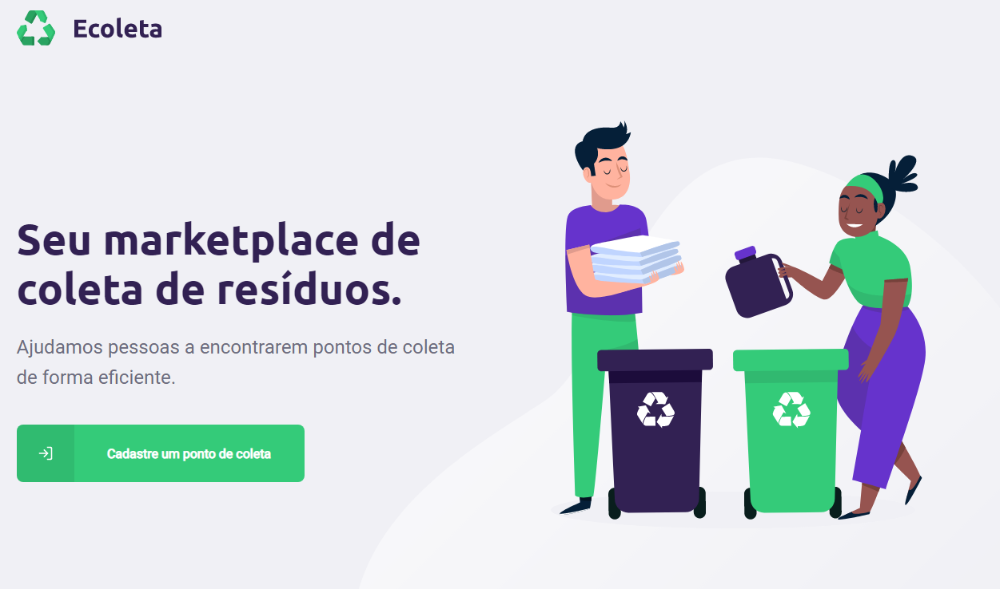

<h1 align="center">
    
</h1>

<h4 align="center"> 
	Next Level Week 1.0 🚀
</h4>


## :zap: Backend

- [NodeJs][nodejs] - Node.js® is a JavaScript runtime built on Chrome's V8 JavaScript engine.
- [SQLite][sqlite] - SQLite is a C-language library that implements a small, fast, self-contained, high-reliability, full-featured, SQL database engine. 
- [Axios][axios] - Promise based HTTP client for the browser and node.js.
- [Knex](http://knexjs.org/) - A query builder for PostgreSQL, MySQL and SQLite3, designed to be flexible, portable, and fun to use.
- [Multer](https://github.com/expressjs/multer) - Node.js middleware for handling multipart/form-data, which is primarily used for uploading files.
- [Celebrate](https://github.com/arb/celebrate) - A joi validation middleware for Express.


#### :heavy_dollar_sign: Run Scripts
```bash
yarn knex-migrate
yarn knex-seed
yarn 
yarn install
yarn dev
```

## :fireworks: Frontend

- [React][reactjs] - A JavaScript library for building user interfaces.
- [Axios][axios] - Promise based HTTP client for the browser and node.js.
- [React Router Dom](https://github.com/ReactTraining/react-router#readme) - Declarative routing for React.
- [React Icons](https://react-icons.github.io/react-icons/) - Include popular icons in your React projects easily with react-icons, which utilizes ES6 imports that allows you to include only the icons that your project is using.
- [React Dropzone](https://react-dropzone.js.org/) - Simple HTML5 drag-drop zone with React.js
- [Leaflet](https://leafletjs.com/) - An open-source JavaScript library for mobile-friendly interactive maps.
- [React Leaflet](https://react-leaflet.js.org/) - ⚛️ React components for 🍃 Leaflet maps.

#### :heavy_dollar_sign: Run Scripts
```bash
yarn install
yarn start
```



## :iphone: Mobile

- [React Native][reactnative] - React Native combines the best parts of native development with React, a best-in-class JavaScript library for building user interfaces.
- [React Navigation](https://reactnavigation.org/) - Routing and navigation for your React Native apps.
- [Axios][axios] - Promise based HTTP client for the browser and node.js.
- [Expo][expo] - Expo is an open-source platform for making universal native apps for Android, iOS, and the web with JavaScript and React.
- [Expo Constants](https://docs.expo.io/versions/latest/sdk/constants/) - Provides system information that remains constant throughout the lifetime of your app's install.
- [Expo Font](https://docs.expo.io/versions/latest/sdk/font/) - Allows loading fonts from the web and using them in React Native components. See more detailed usage information in the Using Custom Fonts guide.
- [Expo Location](https://docs.expo.io/versions/latest/sdk/location/) - Allows reading geolocation information from the device. Your app can poll for the current location or subscribe to location update events.

#### :heavy_dollar_sign: Run Scripts
```bash
yarn install
yarn start
# Run on expo
```

## :bullettrain_side: Contributing

1. Fork it
2. Create your feature branch (`git checkout -b my-new-feature`)
3. Commit your changes (`git commit -am 'Added some feature'`)
4. Push to the branch (`git push origin my-new-feature`)
5. Create new Pull Request


[rocketseat]: https://github.com/rocketseat
[nodejs]: https://nodejs.org
[reactjs]: https://reactjs.org/
[sqlite]:https://www.sqlite.org/index.html
[axios]: https://github.com/axios/axios
[expo]: https://expo.io/
[reactnative]: https://reactnative.dev/

[nlw]: https://github.com/tacsio/nextlevelweek1/blob/master/.github/nlw.svg
